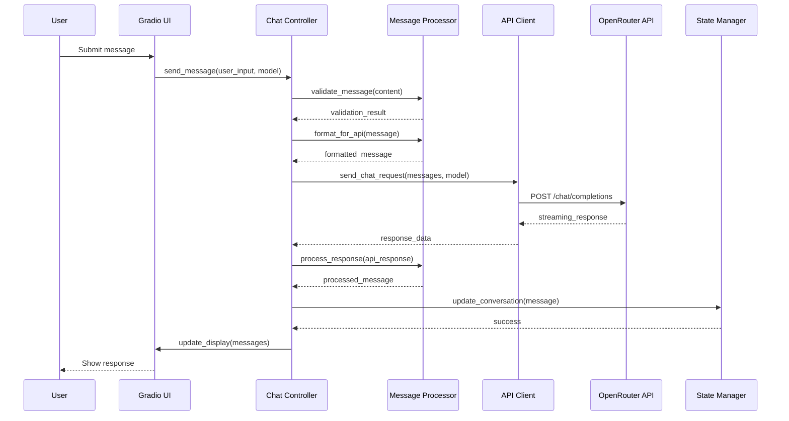
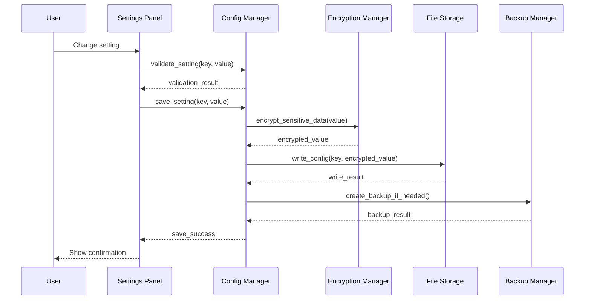
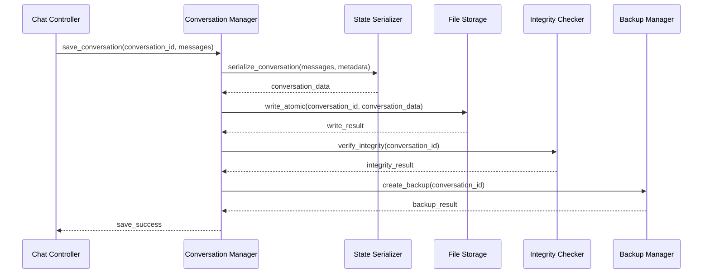

# Data Flow Specifications - Personal AI Chatbot

## Overview

This document specifies the complete data flow architecture for the Personal AI Chatbot, including primary interaction flows, error handling flows, and data transformation patterns. All flows are designed with reliability, observability, and user experience as primary concerns.

## Primary Data Flow Categories

### 1. Chat Interaction Flow
### 2. Configuration Management Flow
### 3. Conversation Persistence Flow
### 4. API Integration Flow
### 5. Error Handling and Recovery Flow
### 6. System Health Monitoring Flow

## 1. Chat Interaction Flow

### 1.1 Message Submission Flow

```
┌─────────────┐    ┌─────────────────┐    ┌──────────────────┐
│   User      │    │   Gradio UI     │    │  Chat Controller │
│   Input     │───▶│   Validation    │───▶│  Process Input   │
└─────────────┘    └─────────────────┘    └──────────────────┘
                                                        │
                                                        ▼
┌──────────────────┐    ┌─────────────────┐    ┌─────────────┐
│ Message         │    │   API Client    │    │ OpenRouter  │
│ Processor       │───▶│   Request       │───▶│    API      │
└──────────────────┘    └─────────────────┘    └─────────────┘
                                                        │
                                                        ▼
┌──────────────────┐    ┌─────────────────┐    ┌─────────────┐
│   Response      │    │   State         │    │   UI        │
│   Processing    │◀───│   Manager       │◀───│   Update    │
└──────────────────┘    └─────────────────┘    └─────────────┘
```

**Sequence Diagram**:



**Data Transformation Pipeline**:

```python
# Input: Raw user string
user_input: str = "Hello, how are you?"

# Step 1: Validation
validation_result = MessageProcessor.validate_message(user_input)
# Output: Tuple[bool, str] = (True, "")

# Step 2: Message Creation
message = Message(
    id=generate_uuid(),
    role="user",
    content=user_input,
    timestamp=datetime.now(),
    metadata={"source": "ui_input"}
)

# Step 3: API Formatting
api_payload = MessageProcessor.format_for_api(message)
# Output: Dict with OpenAI-compatible format
{
    "messages": [{"role": "user", "content": user_input}],
    "model": "anthropic/claude-3-haiku",
    "stream": True,
    "temperature": 0.7
}

# Step 4: API Response Processing
api_response = {
    "id": "chatcmpl-123",
    "choices": [{"message": {"content": "I'm doing well, thank you!"}}],
    "usage": {"total_tokens": 150}
}

processed_message = MessageProcessor.process_response(api_response)
# Output: Message object with metadata
```

### 1.2 Streaming Response Flow

```
┌─────────────┐    ┌─────────────────┐    ┌──────────────────┐
│   API       │    │   Stream        │    │   UI Update     │
│   Response  │───▶│   Processor     │───▶│   Chunks        │
└─────────────┘    └─────────────────┘    └──────────────────┘
                                                        │
                                                        ▼
┌──────────────────┐    ┌─────────────────┐    ┌─────────────┐
│   Buffer        │    │   Display       │    │   User      │
│   Management    │───▶│   Formatting    │───▶│   Feedback  │
└──────────────────┘    └─────────────────┘    └─────────────┘
```

**Streaming Data Flow**:

```python
async def handle_streaming_response():
    """Process streaming response with real-time UI updates"""

    response_buffer = []
    display_chunks = []

    async for chunk in api_client.stream_response():
        # Process chunk
        processed_chunk = process_chunk(chunk)
        response_buffer.append(processed_chunk)

        # Update UI incrementally
        display_chunks.append(format_for_display(processed_chunk))
        ui_update_queue.put(display_chunks)

        # Check for completion
        if is_complete(chunk):
            break

    # Final processing
    final_message = create_final_message(response_buffer)
    save_to_conversation(final_message)
```

## 2. Configuration Management Flow

### 2.1 Settings Persistence Flow

```
┌─────────────┐    ┌─────────────────┐    ┌──────────────────┐
│   User      │    │   Settings      │    │   Config        │
│   Changes   │───▶│   Validation    │───▶│   Manager       │
└─────────────┘    └─────────────────┘    └──────────────────┘
                                                        │
                                                        ▼
┌──────────────────┐    ┌─────────────────┐    ┌─────────────┐
│   Encryption    │    │   File          │    │   Backup     │
│   Layer         │───▶│   Storage       │───▶│   Creation   │
└──────────────────┘    └─────────────────┘    └─────────────┘
```

**Configuration Data Structures**:

```python
@dataclass
class ApplicationConfig:
    """Complete application configuration"""
    api_key: str  # Encrypted
    active_model: str
    ui_theme: str
    max_tokens: int
    temperature: float
    conversation_retention_days: int
    auto_save_interval: int
    rate_limit_requests_per_minute: int
    enable_streaming: bool
    enable_error_logging: bool

@dataclass
class ConfigOperation:
    """Configuration change operation"""
    operation_id: str
    timestamp: datetime
    operation_type: str  # 'create', 'update', 'delete'
    key_path: str
    old_value: Any
    new_value: Any
    user_id: str = "single_user"
```

**Configuration Flow Sequence**:



## 3. Conversation Persistence Flow

### 3.1 Save Conversation Flow

```
┌─────────────┐    ┌─────────────────┐    ┌──────────────────┐
│   User      │    │   Conversation  │    │   State         │
│   Action    │───▶│   Manager       │───▶│   Serialization │
└─────────────┘    └─────────────────┘    └──────────────────┘
                                                        │
                                                        ▼
┌──────────────────┐    ┌─────────────────┐    ┌─────────────┐
│   File          │    │   Integrity     │    │   Backup     │
│   Storage       │───▶│   Check         │───▶│   Creation   │
└──────────────────┘    └─────────────────┘    └─────────────┘
```

**Conversation Data Format**:

```json
{
  "conversation_id": "conv_123456",
  "metadata": {
    "title": "AI Assistant Discussion",
    "created_at": "2024-01-15T10:30:00Z",
    "updated_at": "2024-01-15T11:45:00Z",
    "model_used": "anthropic/claude-3-haiku",
    "total_tokens": 2450,
    "message_count": 12,
    "tags": ["productivity", "coding"]
  },
  "messages": [
    {
      "id": "msg_001",
      "role": "user",
      "content": "How can I improve my Python code?",
      "timestamp": "2024-01-15T10:30:00Z",
      "tokens": 8,
      "metadata": {}
    },
    {
      "id": "msg_002",
      "role": "assistant",
      "content": "Here are several ways to improve your Python code...",
      "timestamp": "2024-01-15T10:30:05Z",
      "model": "anthropic/claude-3-haiku",
      "tokens": 342,
      "metadata": {
        "finish_reason": "stop",
        "usage": {"prompt_tokens": 8, "completion_tokens": 342}
      }
    }
  ]
}
```

**Persistence Flow Sequence**:



## 4. API Integration Flow

### 4.1 Request Processing Flow

```
┌─────────────┐    ┌─────────────────┐    ┌──────────────────┐
│   Message   │    │   Rate Limit    │    │   Request        │
│   Queue     │───▶│   Handler       │───▶│   Builder        │
└─────────────┘    └─────────────────┘    └──────────────────┘
                                                        │
                                                        ▼
┌──────────────────┐    ┌─────────────────┐    ┌─────────────┐
│   HTTP          │    │   Response      │    │   Error      │
│   Client        │───▶│   Parser        │───▶│   Handler    │
└──────────────────┘    └─────────────────┘    └─────────────┘
```

**API Request Flow**:

```python
async def process_api_request(messages, model, **kwargs):
    """Complete API request processing flow"""

    # Rate limiting check
    if not rate_limiter.can_make_request():
        await rate_limiter.wait_for_slot()

    # Build request payload
    request_payload = build_request_payload(messages, model, **kwargs)

    # Add authentication
    headers = {
        "Authorization": f"Bearer {api_key}",
        "Content-Type": "application/json",
        "HTTP-Referer": "https://personal-chatbot.local",
        "X-Title": "Personal AI Chatbot"
    }

    # Execute request with retry logic
    response = await execute_with_retry(
        url="https://openrouter.ai/api/v1/chat/completions",
        method="POST",
        headers=headers,
        json=request_payload,
        timeout=30.0
    )

    # Parse response
    if response.status_code == 200:
        return parse_success_response(response.json())
    else:
        return handle_api_error(response)
```

**Error Handling Decision Tree**:

```python
def handle_api_error(response):
    """Comprehensive API error handling"""

    status_code = response.status_code
    error_data = response.json()

    if status_code == 401:
        # Authentication error
        raise AuthenticationError("Invalid API key")
    elif status_code == 429:
        # Rate limit exceeded
        retry_after = int(response.headers.get('Retry-After', 60))
        raise RateLimitError(f"Rate limit exceeded. Retry after {retry_after}s")
    elif status_code == 400:
        # Bad request
        if 'model' in error_data.get('error', {}).get('message', '').lower():
            raise ModelError("Selected model is not available")
        else:
            raise ValidationError("Invalid request parameters")
    elif status_code >= 500:
        # Server error
        raise ServerError("OpenRouter API server error")
    else:
        # Unknown error
        raise APIError(f"Unexpected API error: {status_code}")
```

## 5. Error Handling and Recovery Flow

### 5.1 Cascading Error Recovery

```
┌─────────────┐    ┌─────────────────┐    ┌──────────────────┐
│   Error     │    │   Error         │    │   Recovery      │
│   Detection │───▶│   Classification│───▶│   Strategy      │
└─────────────┘    └─────────────────┘    └──────────────────┘
                                                        │
                                                        ▼
┌──────────────────┐    ┌─────────────────┐    ┌─────────────┐
│   User          │    │   State         │    │   Logging    │
│   Notification  │◀───│   Preservation  │◀───│   & Audit    │
└──────────────────┘    └─────────────────┘    └─────────────┘
```

**Error Recovery Patterns**:

```python
class ErrorRecoveryManager:
    """Manages error recovery strategies"""

    async def handle_error(self, error: Exception, context: Dict) -> RecoveryResult:
        """Main error handling entry point"""

        # Classify error
        error_type = self.classify_error(error)

        # Select recovery strategy
        strategy = self.select_recovery_strategy(error_type, context)

        # Execute recovery
        try:
            result = await strategy.execute(context)
            self.log_recovery_success(error_type, result)
            return result
        except Exception as recovery_error:
            self.log_recovery_failure(error_type, recovery_error)
            return self.fallback_recovery(error_type, context)

    def classify_error(self, error: Exception) -> ErrorType:
        """Classify error by type and severity"""
        if isinstance(error, RateLimitError):
            return ErrorType.RATE_LIMIT
        elif isinstance(error, AuthenticationError):
            return ErrorType.AUTHENTICATION
        elif isinstance(error, NetworkError):
            return ErrorType.NETWORK
        elif isinstance(error, ValidationError):
            return ErrorType.VALIDATION
        else:
            return ErrorType.UNKNOWN

    def select_recovery_strategy(self, error_type: ErrorType, context: Dict) -> RecoveryStrategy:
        """Select appropriate recovery strategy"""
        strategies = {
            ErrorType.RATE_LIMIT: RateLimitRecovery(),
            ErrorType.AUTHENTICATION: AuthenticationRecovery(),
            ErrorType.NETWORK: NetworkRecovery(),
            ErrorType.VALIDATION: ValidationRecovery(),
            ErrorType.UNKNOWN: GenericRecovery()
        }
        return strategies.get(error_type, GenericRecovery())
```

### 5.2 Recovery Strategy Classes

```python
class RateLimitRecovery(RecoveryStrategy):
    async def execute(self, context: Dict) -> RecoveryResult:
        wait_time = context.get('retry_after', 60)
        await asyncio.sleep(wait_time)
        return RecoveryResult.RETRY

class NetworkRecovery(RecoveryStrategy):
    async def execute(self, context: Dict) -> RecoveryResult:
        # Implement exponential backoff
        attempt = context.get('attempt', 1)
        wait_time = min(2 ** attempt, 300)  # Max 5 minutes
        await asyncio.sleep(wait_time)

        # Test connection
        if await self.test_connection():
            return RecoveryResult.RETRY
        else:
            return RecoveryResult.FAIL

class AuthenticationRecovery(RecoveryStrategy):
    async def execute(self, context: Dict) -> RecoveryResult:
        # Prompt user for new API key
        await self.request_new_credentials()
        return RecoveryResult.USER_INTERVENTION

class ValidationRecovery(RecoveryStrategy):
    async def execute(self, context: Dict) -> RecoveryResult:
        # Sanitize and retry with corrected data
        corrected_data = self.sanitize_input(context['input'])
        context['input'] = corrected_data
        return RecoveryResult.RETRY_CORRECTED
```

## 6. System Health Monitoring Flow

### 6.1 Health Check Flow

```
┌─────────────┐    ┌─────────────────┐    ┌──────────────────┐
│   Health    │    │   Component     │    │   Metrics       │
│   Scheduler │───▶│   Checks        │───▶│   Collection    │
└─────────────┘    └─────────────────┘    └──────────────────┘
                                                        │
                                                        ▼
┌──────────────────┐    ┌─────────────────┐    ┌─────────────┐
│   Threshold     │    │   Alert         │    │   Action     │
│   Evaluation    │───▶│   Generation    │───▶│   Execution  │
└──────────────────┘    └─────────────────┘    └─────────────┘
```

**Health Metrics Collection**:

```python
@dataclass
class SystemHealth:
    """Complete system health snapshot"""
    timestamp: datetime

    # Application metrics
    memory_usage_mb: float
    cpu_usage_percent: float
    active_threads: int
    open_file_handles: int

    # API metrics
    api_response_time_avg: float
    api_error_rate: float
    rate_limit_hits: int
    active_connections: int

    # Storage metrics
    storage_used_mb: float
    conversations_count: int
    corrupted_files: int
    backup_age_hours: float

    # UI metrics
    ui_response_time_avg: float
    active_sessions: int
    error_notifications: int

    # Overall status
    overall_status: HealthStatus

class HealthMonitor:
    """Continuous health monitoring"""

    def __init__(self, check_interval: int = 30):
        self.check_interval = check_interval
        self.health_history = deque(maxlen=100)

    async def start_monitoring(self):
        """Start continuous health monitoring"""
        while True:
            health = await self.perform_health_check()
            self.health_history.append(health)

            if self.is_health_degraded(health):
                await self.handle_health_degradation(health)

            await asyncio.sleep(self.check_interval)

    async def perform_health_check(self) -> SystemHealth:
        """Perform comprehensive health check"""
        return SystemHealth(
            timestamp=datetime.now(),
            memory_usage_mb=self.get_memory_usage(),
            cpu_usage_percent=self.get_cpu_usage(),
            # ... other metrics
            overall_status=self.calculate_overall_status()
        )

    def is_health_degraded(self, health: SystemHealth) -> bool:
        """Determine if health is degraded"""
        thresholds = {
            'memory_usage_mb': 400,
            'cpu_usage_percent': 80,
            'api_error_rate': 0.05,
            'storage_used_mb': 900
        }

        return any(
            getattr(health, metric) > threshold
            for metric, threshold in thresholds.items()
        )
```

## Data Flow Quality Assurance

### Flow Validation Rules

1. **Completeness**: All data transformations must preserve required information
2. **Consistency**: Data formats must remain consistent across flow boundaries
3. **Integrity**: Data integrity must be maintained through checksums and validation
4. **Performance**: Flows must complete within specified time limits
5. **Observability**: All flows must be logged and monitored for debugging

### Flow Testing Strategy

```python
class DataFlowTester:
    """Test data flows for correctness and performance"""

    def test_flow_completeness(self, flow_name: str, input_data: Any) -> TestResult:
        """Test that data flows preserve all required information"""

    def test_flow_performance(self, flow_name: str, input_data: Any) -> PerformanceResult:
        """Test flow performance against benchmarks"""

    def test_error_handling(self, flow_name: str, error_scenario: str) -> ErrorTestResult:
        """Test error handling in data flows"""

    def test_concurrent_access(self, flow_name: str, concurrency_level: int) -> ConcurrencyResult:
        """Test flow behavior under concurrent access"""
```

### Monitoring and Alerting

```python
class FlowMonitor:
    """Monitor data flows for issues"""

    def track_flow_metrics(self, flow_name: str, execution_time: float, success: bool):
        """Track flow execution metrics"""

    def detect_flow_anomalies(self, flow_name: str) -> List[Anomaly]:
        """Detect anomalies in flow behavior"""

    def generate_flow_alerts(self, anomalies: List[Anomaly]) -> List[Alert]:
        """Generate alerts for flow issues"""
```

These data flow specifications provide a comprehensive blueprint for implementing reliable, observable, and maintainable data processing throughout the Personal AI Chatbot system.